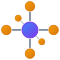
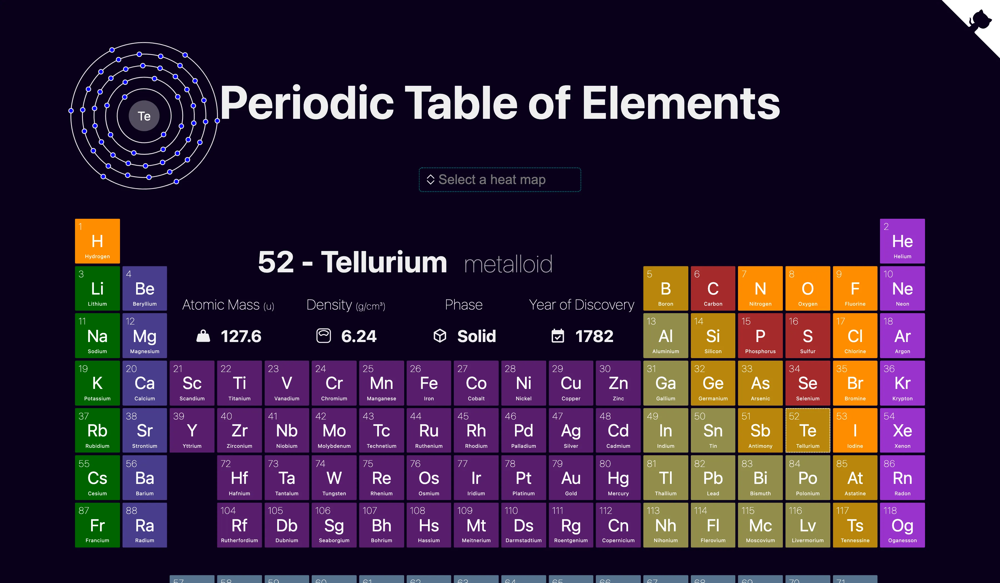
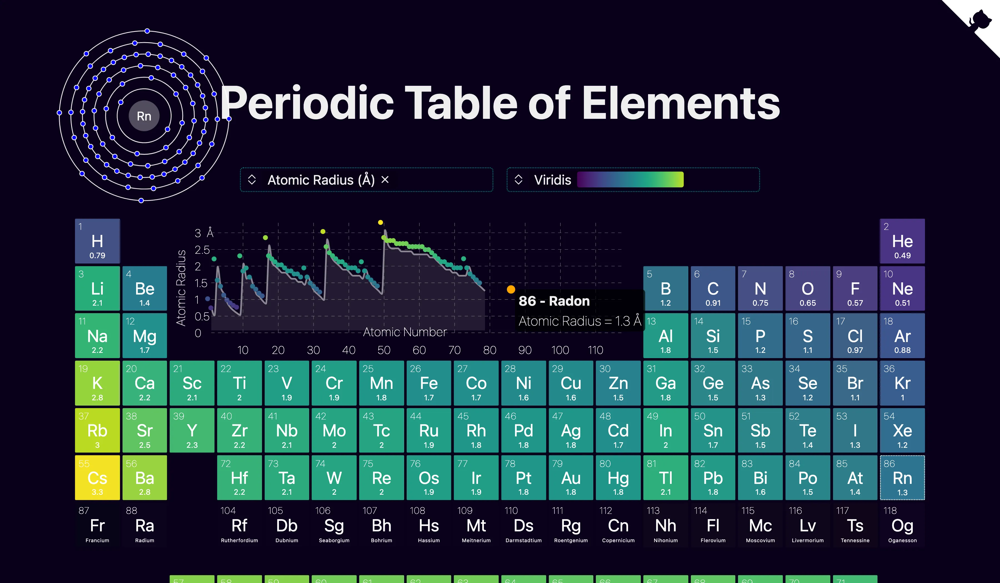

<h1 align="center">
  <sub></sub> CatGo
</h1>

<h4 align="center">

[](https://github.com/Hello-QM/catgo-LRG/actions/workflows/test.yml)

</h4>

`catgo` is a toolkit for building interactive web UIs for materials science: periodic tables, 3d crystal structures (and molecules, though needs some improvements!), Bohr atoms, nuclei, heatmaps, scatter plots. It's under active development and not yet ready for production use but we appreciate any feedback from beta testers! 🙏

## 🔌 &thinsp; [CatGo VSCode Extension]

Visualize crystal structures, molecules, and molecular dynamics trajectories [directly in VSCode][CatGo VSCode Extension]. Features include:

- Native support for common file formats (CIF, POSCAR, XYZ, TRAJ, HDF5, etc.)
- Context menu (right click > "Render with CatGo") and keyboard shortcuts (<kbd>ctrl</kbd>+<kbd>shift</kbd>+<kbd>v</kbd> on Windows, <kbd>cmd</kbd>+<kbd>shift</kbd>+<kbd>v</kbd> on Mac) for quick access
- Custom viewer for MD trajectories/geometry optimizations
- **Extensive customization options** via VSCode settings - see [Configuration Guide](extensions/vscode/readme.md#️-configuration--customization) for examples

[catgo vscode extension]: https://github.com/Hello-QM/catgo-LRG/tree/main/extensions/vscode

## 🗺️ &thinsp; Roadmap

This fork is a private downstream of upstream `janosh/catgo` (formerly MatterViz). The web/SvelteKit track has been pruned; only the desktop, Tauri, and VS Code extension builds are maintained here.



## 📦 &thinsp; Heatmap

This screenshot demonstrates the periodicity of elemental properties (i.e. why it's called periodic table). In this case, you're seeing recurring bumps and valleys in the first ionization energy as a function of atomic number.



## ⚛️ &thinsp; 3D Structure Viewer


## ⚛️ &thinsp; Element Details Pages

The details page for gold.

<https://user-images.githubusercontent.com/30958850/186975855-8e0d94f9-e4e3-47a2-9354-9c012b37307c.mp4>

## 🔨 &thinsp; Installation

```sh
npm install --dev catgo
```

## 📙 &thinsp; Usage

### Periodic Table

```svelte
<script>
  import { PeriodicTable } from 'catgo'

  const heatmap_values = { H: 10, He: 4, Li: 8, Fe: 3, O: 24 }
</script>

<PeriodicTable {heatmap_values} />
```

### Structure

```svelte
<script>
  import { Structure } from 'catgo'
  const data_url = '/structures/TiO2.cif'
  // supports .cif, .poscar, .xyz/.extxyz, pymatgen JSON, OPTIMADE JSON, .gz
</script>

<Structure {data_url} style="width: 500px; aspect-ratio: 1" />
```

### Composition

```svelte
<script>
  import { Composition } from 'catgo'
  // modes can be 'pie' (default) | 'bubble' | 'bar'
</script>

<Composition composition="LiFePO4" mode="pie" />
```

### Trajectory

```svelte
<script>
  import { Trajectory } from 'catgo'
  // supports .xyz/.extxyz, .traj, .hdf5, .npz, .pkl, .dat, .gz, .zip, .bz2, .xz
</script>

<Trajectory data_url="/traj/ase-md.xyz" auto_play fps={10} style="max-height: 700px" />
```

## 🧪 &thinsp; Coverage

| Statements                                                                                 | Branches                                                                          | Lines                                                                            |
| ------------------------------------------------------------------------------------------ | --------------------------------------------------------------------------------- | -------------------------------------------------------------------------------- |
|  |  |  |

## 🙏 &thinsp; Acknowledgements

- Element properties in `src/lib/element-data.ts` were combined from [`Bowserinator/Periodic-Table-JSON`](https://github.com/Bowserinator/Periodic-Table-JSON/blob/master/PeriodicTableJSON.json) under Creative Commons license and [`robertwb/Periodic Table of Elements.csv`](https://gist.github.com/robertwb/22aa4dbfb6bcecd94f2176caa912b952) (unlicensed).
- Thanks to [Images of Elements](https://images-of-elements.com) for providing photos of elemental crystals and glowing excited gases.
- Thanks to [@kadinzhang](https://github.com/kadinzhang) and their [Periodicity project](https://ptable.netlify.app) [[code](https://github.com/kadinzhang/Periodicity)] for the idea to display animated Bohr model atoms and inset a scatter plot into the periodic table to visualize the periodic nature of elemental properties.
- Thanks to [@ixxie](https://github.com/ixxie) ([shenhav.fyi](https://shenhav.fyi)) for great suggestions.

This project would not have been possible as a one-person side project without many fine open-source projects. 🙏 To name just a few:

|           3D graphics           |               2D graphics                |                     Docs                     |               Bundler               |               Testing                |
| :-----------------------------: | :--------------------------------------: | :------------------------------------------: | :---------------------------------: | :----------------------------------: |
| [three.js](https://threejs.org) |          [d3](https://d3js.org)          |         [mdsvex](https://mdsvex.com)         |     [vite](https://vitejs.dev)      | [playwright](https://playwright.dev) |
| [threlte](https://threlte.xyz)  | [sharp](https://sharp.pixelplumbing.com) | [rehype](https://github.com/rehypejs/rehype) | [sveltekit](https://kit.svelte.dev) |     [vitest](https://vitest.dev)     |

## How to cite

This fork is a private downstream and is not separately citable. To cite the upstream toolkit, see [janosh/catgo](https://github.com/janosh/catgo) and the [Zenodo record (10.5281/zenodo.17094509)](https://doi.org/10.5281/zenodo.17094509).
